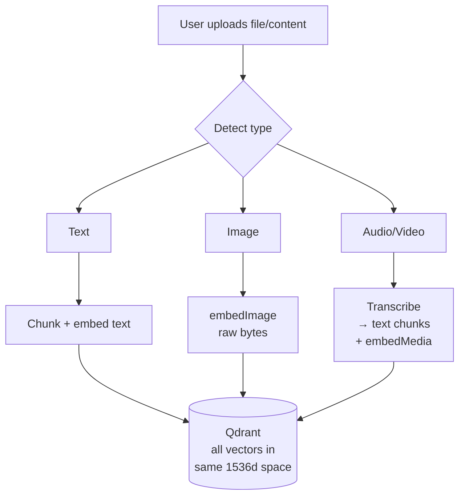

# Multimodal Search with Gemini Embedding 2

A minimal, self-contained implementation of multimodal semantic search using Google's Gemini Embedding 2 and Qdrant. Upload text, images, audio, or video — search across all of them with natural language.

## What This Does

**Traditional search:** text query → matches text documents.

**Multimodal search:** text query → matches text, images, audio, AND video — because all modalities live in the same vector space.

```
"Find the chart showing Bitcoin prices"  →  matches an actual image of a BTC chart
"Meeting about the Q4 budget"            →  matches audio transcript with timestamps
"Product demo on a laptop"               →  matches video content showing a demo
```

## How It Works



| File Type | Processing | Vectors Created |
|-----------|-----------|-----------------|
| **Text** (.txt, .md, .html) | Chunk text | Text vectors (RETRIEVAL_DOCUMENT) |
| **Image** (.png, .jpg) | None needed | Image vector from raw pixels |
| **Audio** (.mp3, .wav) | Gemini transcription | Text vectors + raw audio vector* |
| **Video** (.mp4, .mov) | Gemini transcription | Text vectors + raw video vector* |

*Raw media vectors only for short files (≤80s audio, ≤128s video). Longer files use transcript text vectors.

## Quick Start

### 1. Prerequisites

- **Node.js 18+**
- **Gemini API key** — free at [aistudio.google.com/apikey](https://aistudio.google.com/apikey)
- **Qdrant** — free cloud cluster at [cloud.qdrant.io](https://cloud.qdrant.io), or run locally with Docker:
  ```bash
  docker run -p 6333:6333 qdrant/qdrant
  ```

### 2. Install

```bash
npm install
```

### 3. Configure

```bash
cp .env.example .env
# Edit .env with your API keys
```

### 4. Create Qdrant Collection

```bash
npm run setup
```

### 5. Start

```bash
npm run dev     # watch mode (auto-restart on changes)
# or
npm start       # production
```

## API

### `POST /upload` — Upload a file

```bash
# Upload a text file
curl -F "file=@document.txt" http://localhost:3000/upload

# Upload an image
curl -F "file=@chart.png" http://localhost:3000/upload

# Upload audio
curl -F "file=@meeting.mp3" http://localhost:3000/upload

# Upload video
curl -F "file=@demo.mp4" http://localhost:3000/upload
```

Response:
```json
{
  "success": true,
  "id": "a1b2c3d4-...",
  "filename": "chart.png",
  "type": "image",
  "chunks": 1,
  "mediaEmbedded": true
}
```

### `GET /search?q=...` — Search across all modalities

```bash
curl "http://localhost:3000/search?q=revenue+chart&limit=3"
```

Response:
```json
{
  "query": "revenue chart",
  "results": [
    {
      "score": 0.847,
      "filename": "q4-financials.png",
      "type": "image",
      "content": "[Image: q4-financials.png]",
      "isMediaChunk": false
    },
    {
      "score": 0.721,
      "filename": "earnings-call.mp3",
      "type": "audio",
      "content": "[3:45] Speaker 1: As you can see in the revenue chart...",
      "isMediaChunk": false
    }
  ]
}
```

### `GET /health` — Check connectivity

```bash
curl http://localhost:3000/health
```

## Project Structure

```
src/
├── config.ts        # Environment configuration
├── embed.ts         # Gemini Embedding 2 API (text, image, audio, video)
├── transcribe.ts    # Gemini audio/video transcription with File API
├── ingest.ts        # Upload pipeline: detect → process → chunk → embed → store
├── search.ts        # Query embedding + vector similarity search
├── vector-store.ts  # Vector DB abstraction (Qdrant default + Pinecone/Weaviate/Chroma/Milvus examples)
├── setup.ts         # One-time collection creation
└── server.ts        # Fastify server with 3 endpoints
```

Each file is self-contained and heavily commented — read them in order for a complete understanding of the pipeline.

## Using a Different Vector Database

The project uses a `VectorStore` interface that abstracts the vector database. Qdrant is the default, but `vector-store.ts` includes commented-out implementations for:

- **Pinecone** — `npm install @pinecone-database/pinecone`
- **Weaviate** — `npm install weaviate-client`
- **ChromaDB** — `npm install chromadb`
- **Milvus** — `npm install @zilliz/milvus2-sdk-node`

To switch providers:

1. Install the provider's npm package
2. Uncomment the corresponding class in `vector-store.ts`
3. Update the `createVectorStore()` factory to use your provider
4. Update `.env` with your provider's connection details

The `VectorStore` interface is intentionally simple — 4 methods:

```typescript
interface VectorStore {
  ensureCollection(name: string, dimensions: number): Promise<void>;
  upsert(collection: string, points: VectorPoint[]): Promise<void>;
  search(collection: string, vector: number[], limit: number): Promise<SearchHit[]>;
  healthCheck(): Promise<boolean>;
}
```

## Key Concepts

### Task-Type Specialization

Gemini supports asymmetric embedding: content is embedded with `RETRIEVAL_DOCUMENT`, queries with `RETRIEVAL_QUERY`. This improves retrieval accuracy by 5–15% compared to using the same task type for both.

```typescript
// Storing a document chunk
const vector = await embedDocument("The company's Q3 revenue was $125M");

// Searching for it later
const queryVector = await embedQuery("What was the Q3 revenue?");
```

### Cross-Modal Embedding

All modalities produce vectors in the same 1536-dimensional space. This means a text description and a visual representation of the same concept produce similar vectors:

```typescript
// These produce vectors that are close to each other:
const textVector  = await embedDocument("A line chart showing Bitcoin price from 2014 to 2024");
const imageVector = await embedImage(bitcoinChartPng, "image/png");
// cosine_similarity(textVector, imageVector) ≈ 0.65-0.85
```

### Audio/Video Dual Embedding

Media files get two types of vectors:

1. **Transcript text vectors** — from Gemini transcription, chunked and embedded as text. Searchable by what was *said*.
2. **Raw media vector** — the actual audio/video embedded directly (for short files). Searchable by how it *sounds/looks*.

### Gemini File API

Files over 20MB are uploaded to Gemini's File API before processing:

```typescript
// Small file: base64 inline (faster)
const response = await model.generateContent([
  { inlineData: { mimeType: "audio/mpeg", data: buffer.toString("base64") } },
  { text: "Transcribe this audio..." }
]);

// Large file: File API upload (handles up to 2GB)
const upload = await genai.files.upload({ file: blob, config: { mimeType } });
// ... poll until ready ...
const response = await model.generateContent([
  { fileData: { fileUri: upload.uri } },
  { text: "Transcribe this audio..." }
]);
```

## Limitations

| Limitation | Details |
|-----------|---------|
| **Audio embedding max** | 80 seconds per request |
| **Video embedding max** | 128 seconds per request |
| **File upload max** | 200MB (in-memory buffering) |
| **No PDF parsing** | Text files only; add a PDF library for PDF support |
| **No chunking strategy** | Simple paragraph splitting; production systems use semantic chunking |
| **No keyword search** | Vector-only; production systems add BM25 hybrid search |
| **No reranking** | Results are raw vector similarity; add a cross-encoder for better ranking |

## Adapting for Production

This example is intentionally minimal. For a production system, consider adding:

- **Hybrid search** (BM25 keyword + vector) for better recall
- **Cross-encoder reranking** for better precision
- **Semantic chunking** that respects document structure
- **Authentication and multi-tenancy** (workspace isolation)
- **PDF/DOCX processing** via Document AI or libraries
- **Streaming uploads** to cloud storage (avoid in-memory buffering for large files)
- **Queue-based ingestion** for async processing of large files

## License

MIT
